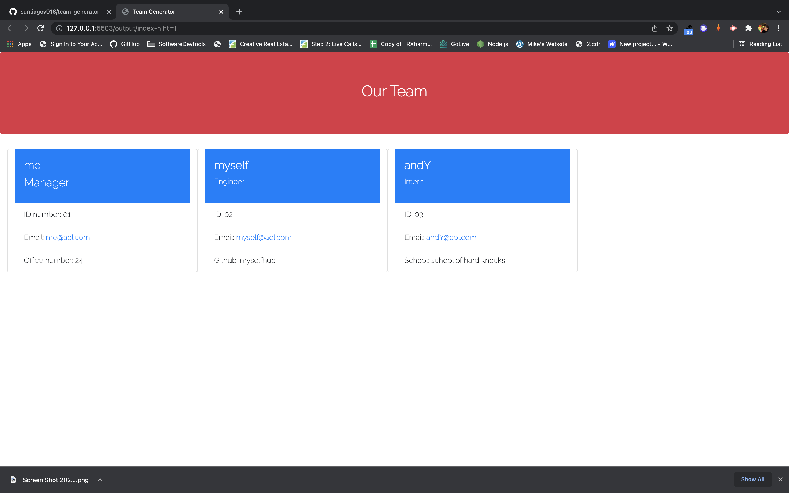

  # Team-Generator

  
  
  ## Table of Content
  
  * [Description](#description)
  
  * [Motivation](#motivation)
  
  * [Usage](#usage)
  
  * [Installation](#Installation)
  
  * [Contributors and more](#contributors)
  
  * [Questions](#questions)

  ## Description

  this is an object-oriented- program, tested by using jest! Enter node index inside of the command and you will be prompted to enter a few questions about you and your team. Once all team members are added, you will be given a page to generate all members and their specific info! This is great for anyone who needs a quick printout of their team info!
  
  ## Motivation

  I'm involved and work with a lot of people and staying organized is key to a great project! What better way to start a project to know whose involved, their information, specialties, and role they play!

  ## Usage

  use inside of the command line/ terminal

  ## Installation 

  ### Dependencies: inquirer and jest
  ### To install: npm i OR npm install
  ### CLI to start: node index or node index.js

  ## Contributors

  ### People: Myself and a few friends
  ### GitHub Username: santiagov916
  ### GitHub Link to project: https://github.com/santiagov916/team-generator

  ## Questions?

  ### Email the programmer: gme.santi24@yahoo.com
  ### Video of the program in action: https://watch.screencastify.com/v/2qYvMm19WJDGIbe92BB2
  ### Screenshot of working code:
  
